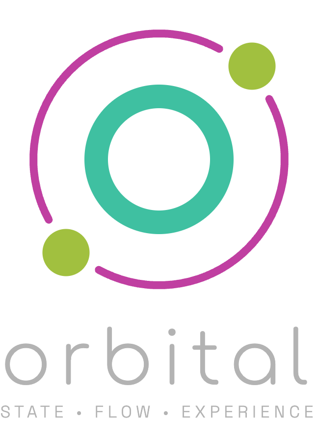

# Orbital (ORB)

ORB es un mini-framework ligero para crear aplicaciones interactivas con HTML, CSS y JavaScript, pensado para ejecutarse en web y evolucionar a PWA instalable. Aunque nació orientado a juegos, su diseño sirve igual para aplicaciones estándar con navegación por pantallas y lógica de estado.

La idea central es construir la aplicación como una máquina de estados: no se navega mostrando pantallas directamente, sino cambiando el estado de la aplicación. Ese cambio activa o desactiva pantallas y define las rutas de navegación permitidas.

Este enfoque mantiene el comportamiento predecible, simplifica el crecimiento del proyecto y reduce errores de UI cuando la aplicación escala.

Incluye:

- ScreenController para mostrar, apilar y cerrar pantallas
- StateController para modelar estados y transiciones
- BaseScreen para encapsular la lógica de cada pantalla
- I18n para traducir el DOM con data-i18n
- ModalDialog para modales sencillos
- findUIElement para localizar elementos por data-ui jerárquico
- CSS base para shell, pantallas, botones, efectos y modal

## Visión del framework

- App-first y multiplataforma: pensado para experiencias web que funcionan bien en móvil y escritorio
- PWA-ready: estructura adecuada para convertir el proyecto en app instalable
- Multiuso: válido para juegos y para aplicaciones de negocio o utilidad
- Arquitectura explícita: estados, transiciones y pantallas desacopladas

## Modelo de arquitectura recomendado

1. Define los estados de la aplicación y sus transiciones válidas
2. Conecta cada estado a la activación de una pantalla
3. Haz cada pantalla autocontenida en su ciclo de vida
4. Navega siempre por cambios de estado, no por toggles directos de DOM

### Principios clave

- El estado manda; la UI reacciona
- Las pantallas no se muestran por acceso directo desde cualquier parte del código
- Cada pantalla crea recursos al activarse y los libera al desactivarse
- La navegación es declarativa: solo transiciones permitidas

### Ciclo de vida de una pantalla

Al activarse una pantalla:

- engancha listeners
- inicia temporizadores o animaciones
- reserva recursos necesarios para esa vista

Al desactivarse una pantalla:

- desengancha listeners
- detiene temporizadores o animaciones
- libera recursos para evitar fugas y comportamientos fantasma

Este patrón permite pantallas robustas, aisladas y fáciles de mantener.

## Marca

Nombre oficial: Orbital

Por qué encaja:

- Es corto, recordable y suena a producto
- Comunica navegación y recorrido entre pantallas sin sonar técnico
- Es suficientemente amplio para juegos y apps estándar

Identidad visual:

- Logo Orbital con motivo de órbitas y descriptor: State • Flow • Experience

Codename / acrónimo: ORB

Convención de naming:

- prefijo CSS: orb-
- namespace JS: ORB
- nombre de paquete: orbital

## Quick Start (TLDR)

Si solo quieres arrancar rápido:

1. Instala y carga estilos

```bash
npm install orbital
```

```js
import { BaseScreen, ScreenController, StateController, findUIElement } from "orbital";
import "orbital/style.css";
```

2. Crea dos pantallas en HTML con data-ui

```html
<main class="orb-app-shell">
  <section data-ui="menu-screen" class="orb-screen">
    <button data-ui="go-about">About</button>
  </section>

  <section data-ui="about-screen" class="orb-screen not-active">
    <button data-ui="go-back">Volver</button>
  </section>
</main>
```

3. Conecta estado + navegación

```js
class AppState extends StateController {
  constructor() {
    super();
    this.setStateTransitions({ menu: ["about"], about: ["menu"] });
  }
}

class MenuScreen extends BaseScreen {
  constructor(controller) {
    super(controller, findUIElement("menu-screen"), ["go-about"]);
  }
  initEventListeners() {
    this._el.goAbout.addEventListener("click", () => this.controller.state.change("about"));
  }
}

class AboutScreen extends BaseScreen {
  constructor(controller) {
    super(controller, findUIElement("about-screen"), ["go-back"]);
  }
  initEventListeners() {
    this._el.goBack.addEventListener("click", () => this.controller.state.change("menu"));
  }
}

class App extends ScreenController {
  constructor() {
    super();
    this.state = new AppState();
  }

  init() {
    this.addScreen("menu", new MenuScreen(this));
    this.addScreen("about", new AboutScreen(this));
    this.state.onEnter("menu", () => this.showScreen("menu"));
    this.state.onEnter("about", () => this.showScreen("about"));
    this.state.change("menu");
  }
}

document.addEventListener("DOMContentLoaded", () => new App().init());
```

Con eso ya tienes una app mínima funcional.

## Guía didáctica

## API rápida

Referencia rápida de exports:

Exports principales:

- BaseScreen
- ScreenController
- StateController
- I18n
- ModalDialog
- findUIElement
- ORB (namespace por defecto)

Snippet rápido:

```js
import {
  BaseScreen,
  ScreenController,
  StateController,
  I18n,
  ModalDialog,
  findUIElement,
} from "orbital";

import "orbital/style.css";
```

## Cómo usarlo

### 1. Desde npm

```bash
npm install orbital
```

```js
import {
  BaseScreen,
  ScreenController,
  StateController,
  I18n,
  ModalDialog,
  findUIElement,
} from "orbital";

import "orbital/style.css";
```

Tambien puedes usar el namespace por defecto:

```js
import ORB from "orbital";

const { BaseScreen, ScreenController, StateController, I18n, findUIElement } = ORB;
```

### 2. Desde CDN (dist)

```html
<link rel="stylesheet" href="https://cdn.jsdelivr.net/gh/dealfonso/Orbital@main/dist/style.css">
<script type="module">
  import {
    BaseScreen,
    ScreenController,
    StateController,
    I18n,
    findUIElement,
  } from "https://cdn.jsdelivr.net/gh/dealfonso/Orbital@main/dist/index.js";
</script>
```

Puedes fijar una versión concreta cambiando @main por una etiqueta o versión.

### 3. Desde src (desarrollo local)

Si trabajas dentro del repositorio:

```js
import {
  BaseScreen,
  ScreenController,
  StateController,
  I18n,
  findUIElement,
} from "./src/index.js";

import "./src/style.css";
```

### 4. dist o src

- dist: artefactos listos para consumo (bundle ESM + CSS)
- src: código fuente para depurar o desarrollar el framework

## Aplicación mínima paso a paso

Objetivo: dos pantallas, ir y volver, con el menor código posible.

### 1) HTML base

```html
<!DOCTYPE html>
<html lang="es">
<head>
  <meta charset="UTF-8">
  <meta name="viewport" content="width=device-width, initial-scale=1.0">
  <title>ORB demo</title>
  <link rel="stylesheet" href="https://cdn.jsdelivr.net/gh/dealfonso/Orbital@main/dist/style.css">
</head>
<body>
  <main class="orb-app-shell">
    <section data-ui="menu-screen" class="orb-screen orb-effects orb-fade-in">
      <div class="orb-screen-content">
        <h1>Menu</h1>
        <button data-ui="go-about" class="orb-btn">Ir a otra pantalla</button>
      </div>
    </section>

    <section data-ui="about-screen" class="orb-screen not-active orb-effects orb-slide-left orb-fade-in">
      <div class="orb-screen-content">
        <h1>About</h1>
        <button data-ui="go-back" class="orb-btn">Volver</button>
      </div>
    </section>
  </main>

  <script type="module" src="./app.js"></script>
</body>
</html>
```

### 2) Estructura del HTML

- orb-app-shell: contenedor principal que apila pantallas
- orb-screen: cada pantalla
- not-active: pantalla oculta
- orb-screen-content: layout interior base
- orb-screen-stacked-group: variante para overlays de contenido

Cada pantalla debe tener su data-ui raíz, por ejemplo menu-screen, game-screen, settings-screen.

### 3) StateController (estado)

```js
class AppState extends StateController {
  constructor() {
    super();
    this.setStateTransitions({
      menu: ["about"],
      about: ["menu"],
    });
  }
}
```

### 4) ScreenController (navegación)

```js
const screens = new ScreenController();
const state = new AppState();

state.onEnter("menu", () => screens.showScreen("menu"));
state.onEnter("about", () => screens.showScreen("about"));
```

### 5) BaseScreen (lógica de pantalla)

Las uiKeys se resuelven dentro del contenedor de pantalla por data-ui (y opcionalmente por id si dejas fallback activo).

```js
class MenuScreen extends BaseScreen {
  constructor(controller) {
    super(controller, findUIElement("menu-screen"), ["go-about"]);
  }

  initEventListeners() {
    this._el.goAbout.addEventListener("click", () => this.controller.state.change("about"));
  }
}

class AboutScreen extends BaseScreen {
  constructor(controller) {
    super(controller, findUIElement("about-screen"), ["go-back"]);
  }

  initEventListeners() {
    this._el.goBack.addEventListener("click", () => this.controller.state.change("menu"));
  }
}
```

### 6) App completa mínima

```js
import {
  BaseScreen,
  ScreenController,
  StateController,
  findUIElement,
} from "https://cdn.jsdelivr.net/gh/dealfonso/Orbital@main/dist/index.js";

class AppState extends StateController {
  constructor() {
    super();
    this.setStateTransitions({ menu: ["about"], about: ["menu"] });
  }
}

class MenuScreen extends BaseScreen {
  constructor(controller) {
    super(controller, findUIElement("menu-screen"), ["go-about"]);
  }
  initEventListeners() {
    this._el.goAbout.addEventListener("click", () => this.controller.state.change("about"));
  }
}

class AboutScreen extends BaseScreen {
  constructor(controller) {
    super(controller, findUIElement("about-screen"), ["go-back"]);
  }
  initEventListeners() {
    this._el.goBack.addEventListener("click", () => this.controller.state.change("menu"));
  }
}

class App extends ScreenController {
  constructor() {
    super();
    this.state = new AppState();
  }

  init() {
    this.addScreen("menu", new MenuScreen(this));
    this.addScreen("about", new AboutScreen(this));
    this.state.onEnter("menu", () => this.showScreen("menu"));
    this.state.onEnter("about", () => this.showScreen("about"));
    this.state.change("menu");
  }
}

document.addEventListener("DOMContentLoaded", () => new App().init());
```

### Cómo añadir una nueva pantalla

1. Añade un section orb-screen con data-ui propio
2. Añade uiKeys internas con data-ui
3. Añade el nuevo estado en StateController
4. Crea una clase que extienda BaseScreen
5. Registra la pantalla con addScreen
6. Conecta transición de estado con showScreen

Ejemplo corto:

```js
class SettingsScreen extends BaseScreen {
  constructor(controller) {
    super(controller, findUIElement("settings-screen"), ["settings-back"]);
  }

  initEventListeners() {
    this._el.settingsBack.addEventListener("click", () => {
      this.controller.state.change("menu");
    });
  }
}
```

## Estilos básicos

El estilo base vive en style.css e incluye:

- screens.css: shell y estructura de pantallas
- buttons.css: botones y grupos
- effects.css: transiciones y animaciones
- modal.css: estilos del modal

### Clases principales de pantalla

- orb-app-shell
- orb-screen
- orb-screen-content
- orb-screen-stacked-group
- not-active

Estructura típica:

```html
<main class="orb-app-shell">
  <section data-ui="menu-screen" class="orb-screen not-active">
    <div class="orb-screen-content">...</div>
  </section>
</main>
```

### Botones

- orb-btn
- orb-btn icon-btn
- xl / xxl
- orb-button-group

```html
<div class="orb-button-group">
  <button class="orb-btn">Normal</button>
  <button class="orb-btn icon-btn xl">+</button>
</div>
```

### Efectos de transición

Clases disponibles:

- orb-fade-in, orb-fade-out
- orb-slide-up, orb-slide-down, orb-slide-left, orb-slide-right
- orb-scale-up, orb-scale-down, orb-scale-bounce
- orb-shake
- orb-rotate-in-center
- orb-effect-strong, orb-effect-weak
- fast, very-fast, slow, orb-very-slow

Ejemplo:

```html
<section class="orb-screen orb-effects orb-slide-left orb-fade-in">...</section>
```

## I18n

I18n traduce claves en el DOM mediante data-i18n y permite traducir manualmente.

### Uso básico

```js
import { I18n } from "orbital";

const i18n = I18n.getInstance();

i18n.setTranslations({
  es: {
    "app.title": "Mi juego",
    "menu.play": "Jugar",
  },
  en: {
    "app.title": "My game",
    "menu.play": "Play",
  },
});

i18n.setActiveLanguage("es");
```

```html
<h1 data-i18n="app.title">Mi juego</h1>
<button data-i18n="menu.play">Jugar</button>
```

### Traducir una clave

```js
I18n.t("menu.play");
```

### Variables

```js
i18n.setTranslations({ es: { "score.value": "Puntos: {value}" } });
I18n.t("score.value", { value: 120 });
```

### Traducir un scope concreto

```js
const panel = document.querySelector("#panel");
i18n.applyTranslations("es", {}, null, panel);
```

### Extraer cadenas del HTML

```js
const strings = i18n.extractStringsFromHTML();
console.log(strings);
```

## Otros: modal

ModalDialog crea modales con cierre por botón, backdrop, Escape y acciones por data-modal-action.

### HTML mínimo

```html
<div class="orb-modal not-active" data-ui="help-modal" data-backdrop data-escape>
  <div class="orb-modal-content">
    <button class="orb-btn-close" data-close>Cerrar</button>
    <h2>Ayuda</h2>
    <p>Este es un modal sencillo.</p>
    <button class="orb-btn" data-modal-action="accept">Aceptar</button>
  </div>
</div>
```

### JavaScript

```js
import { ModalDialog, findUIElement } from "orbital";

const modalEl = findUIElement("help-modal");
const modal = new ModalDialog(modalEl, {
  buttonActions: {
    accept() {
      console.log("accion accept");
    },
  },
});

document.querySelector("#open-help").addEventListener("click", () => {
  modal.show();
});
```

### Inicializar varios modales

```js
ModalDialog.initModals();
```

### Eventos

- orb-modal-shown
- orb-modal-hidden
- orb-modal-closed
- orb-modal-action-<nombre>

```js
modalEl.addEventListener("orb-modal-closed", () => {
  console.log("modal cerrado");
});
```

## Desarrollo

```bash
npm run build
```
